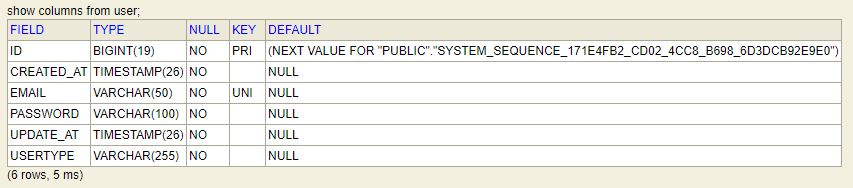
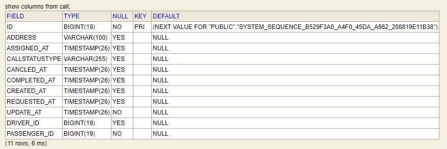
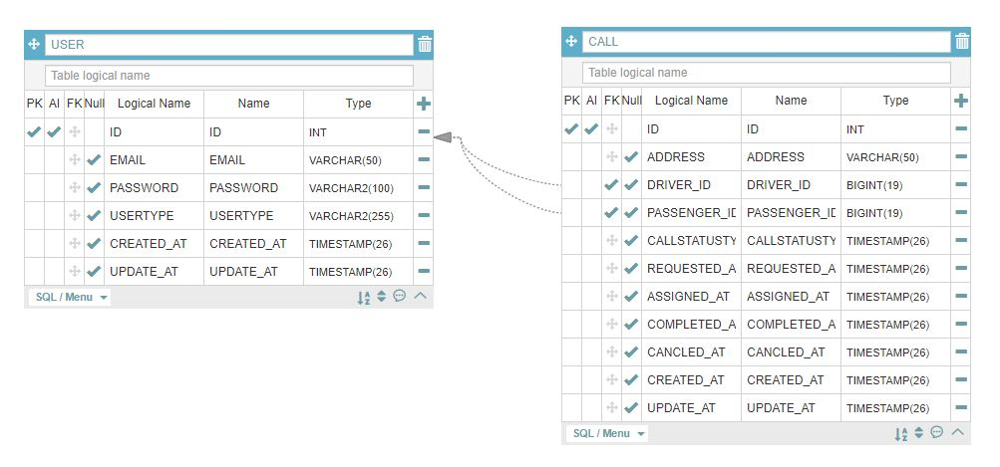

# simpleDispatchApi
Simple  Dispatch API for Spring Boot

## Getting Started

클라이언트에서 사용할 JSON API를 구현하는 과제입니다.
앱의 사용자는 승객과 기사로 구성 되며, 모두 회원가입과 로그인을 거쳐야만 앱을 사용할 수 있습니다.
승객은 특정 주소에서 택스를 타고 싶다고 배차를 요청합니다.
기사들은 요청 목록을 참고하여 원하는 승객을 선택하여 배차를 받습니다.
승객도 요청 목록을 새로 고침하여 본인이 요청한 건에 기사가 배차 되었는지 확인합니다.

### Prerequisites

Java 1.8.x over
Maven 3 over

### Build

Git Download or Clone

./mvn clean install

java -jar homework-api.war 실행.

APIs 동작 확인.
http://localhost:8080/h2-console DB 확인. 

## Built With
* [Language]  - Java 8
* [Framework] - Spring boot 2.1.5.RELEASE
* [Database]  - H2
* [ORM]       - JPA
* [Maven]     - Build & Dependency Management

## Requirement
(필수)
* 회원가입 API 개발
  - 이메일, 비밀번호, 승객/기사 여부를 파라미터로 받습니다.
  - 이미 사용중인 이메일로는 가입 할 수 없어야 합니다.
* 로그인 API 개발
  - 이메일과  비밀번호를 이용하여 로그인 합니다.
* 목록조회 API 개발
  - 서비스 전체의 배차 요청의 목록을 조회 함.
  - 배차가 완료된 목록과 대기중인 요청 모두 목록에 포함 됨.
  - 배차 대기 중인지 완료된 요청인지 목록에 표시 되어야 함.
  - 배차 요청 시간과 배차 완료 시간을 목록에 표시해야 함.
  - 최근에 추가된 요청부터 목록에 보이도록 함.  

* 택시 배차요청 API 개발
  - 승객이 특정 주소에서 요청 함.
  - 주소를 파라미터로 받음
  - 주소는 100자 이내의 String
* 기사 배차 API 개발
  - 기사가 특정 요청을 본인이 맡겠다고 요청 함.
  - 하나의 배차 요청에는 최대 한명의 기사가 배차 되어야 함.
  
## Framework Structure

### common-lib
	* 공통으로 사용하는 클래스들의 집합
	  - 공통코드
	  - APIResponseDto, APIRrrorResponseDto
	  - Exception
	  - response Handler
### homework-api	  
	* API 구현 클래스들의 집합.
	  - Common-lib Jar 의존성 포함.
## APIs

### 기본 구조
 * Data Type : JSON
 
 <table>
	<thead>
	<tr>
	<th align="left">Property</th>
	<th align="left">Description</th>
	<th align="left">Comment</th>
	</tr>
	</thead>
	<tbody>
	<tr>
	<td align="left">code</td>
	<td align="left">응답코드</td>
	<td align="left">200, 400, 404와 같이 Http Status code로 처리결과를 나타냄</td>
	</tr>
	<tr>
	<td align="left">message</td>
	<td align="left">HTTP Reason Phrase 메시지</td>
	<td align="left"></td>
	</tr>
	<tr>
	<td align="left">data</td>
	<td align="left">반환 데이터</td>
	<td align="left"></td>
	</tr>
	</tbody>
</table>

### 회원가입
<blockquote>

URL : /api/{version}/auth/sign

version : v1

Method : POST

</blockquote>
<table>
<thead>
<tr>
<th align="left">Property</th>
<th align="left">Data Type</th>
<th align="left">Mandatory</th>
</tr>
</thead>
<tbody>
<tr>
<td align="left">email</td>
<td align="left">String</td>
<td align="left">Y</td>
</tr>
<tr>
<td align="left">password</td>
<td align="left">String</td>
<td align="left">Y</td>
</tr>
<tr>
<td align="left">userType</td>
<td align="left">String</td>
<td align="left">Y</td>
</tr>
</tbody>
</table>

### 로그인
<blockquote>

URL : /api/{version}/auth/login

version : v1

Method : POST

</blockquote>
<table>
<thead>
<tr>
<th align="left">Property</th>
<th align="left">Data Type</th>
<th align="left">Mandatory</th>
</tr>
</thead>
<tbody>
<tr>
<td align="left">email</td>
<td align="left">String</td>
<td align="left">Y</td>
</tr>
<tr>
<td align="left">password</td>
<td align="left">String</td>
<td align="left">Y</td>
</tr>
</tbody>
</table>

### 목록조회
<blockquote>

URL : api/{version}/call/list 

version : v1

Method : GET

</blockquote>

### 택시 배차요청
<blockquote>

URL : /api/{version}/call/request

version : v1

Method : POST

</blockquote>
<table>
<thead>
<tr>
<th align="left">Property</th>
<th align="left">Data Type</th>
<th align="left">Mandatory</th>
</tr>
</thead>
<tbody>
<tr>
<td align="left">address</td>
<td align="left">String</td>
<td align="left">Y</td>
</tr>
</tbody>
</table>

### 기사 배차
<blockquote>

URL : /api/{version}/call/assign

version : v1

Method : POST

</blockquote>
<table>
<thead>
<tr>
<th align="left">Property</th>
<th align="left">Data Type</th>
<th align="left">Mandatory</th>
</tr>
</thead>
<tbody>
<tr>
<td align="left">id</td>
<td align="left">Long</td>
<td align="left">Y</td>
</tr>
</tbody>
</table>

## 문제해결 전략
공통으로 사용할 코드와 API 기능을 분리하여 개발하였습니다.
공통으로 사용할 코드들은 HTTP 응답 코드와, Response를 담당할 DTO 객체, Response Handler로 구성 하였습니다.
API에서 가장 먼저 사용자 엔티티 설계를 한 후 가입과 로그인 관련 Service를 개발 한 후 
JWT로 API의 인증처리를 개발 하였습니다.
회원 가입시 password는 암호화 후 암호화 된 password를 저장하였습니다.
회원가입/로그인 성공시 email과 userType(Role)정보를 포함한 Access Token 을 응답 코드로 return 합니다.
토큰 만료일은 한 시간으로 만료 시 API접근이 불가하며, 사전에 토큰 갱신을 해야 API 접근이 가능합니다.
발급받은 토큰은 Http Header에 담아 request를 날려야 정상 인증이 됩니다.
인증 이외의 API는 요구사항에 맞게 개발하였습니다.

## DB Infomation

## Acknowledgments

처음에 과제를 보고 생각한 것 보다 미흡하게 마무리하고 제출해야 해서 아쉬운 부분이 많다.
Windows 환경에서 STS로 개발을 진행 하였는데, Maven만 이용 할 수 있는 환경이었고, Maven Multi-module을 사용해서
Spring Rest-Doc을 이용 해 보는 것도 처음이었다.
Spring Rest-Doc를 이용한 이유는 Test Code 작성과 동시에 API Spec 문서를 생성하여 Test Code를 강제 할 생각이었는데
처음 해보는 것이어서 그런지 이틀동안 진행하는 프로젝트에는 익숙한 것을 사용해야 된다는 것을 느꼈다.
조금 더 시간이 있었다면 주행완료, 취소 기능도 같이 개발 하고 싶었는데 어느덧 주말은 주어진 일에만 몰입해서 할 수 없는
날이 된 것 같아 슬프고 아쉽다.
